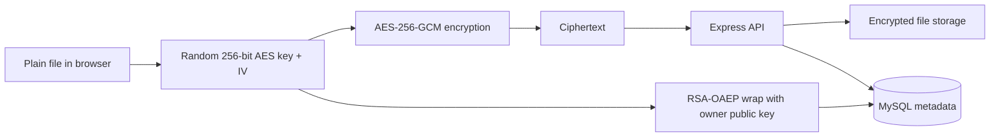

# GlossFile

**Client-side encrypted file storage and secure sharing platform**  
System Analysis & Design course project

GlossFile explores how a cloud-style file platform can reduce server-side exposure of plaintext data by encrypting files in the browser before upload and controlling access through per-user public-key cryptography.

## Why GlossFile?

Traditional file-storage systems often rely heavily on the server to protect user content. GlossFile was designed around a different question:

> **Can the server store and distribute files without needing the plaintext file or the user's private key?**

The project combines system analysis, database and API design, authentication, client-side cryptography, secure sharing workflows, and an administrative interface in one working prototype.

## Core features

- User registration and session-based authentication
- bcrypt password hashing
- Optional email-based multi-factor authentication (MFA)
- Client-side file encryption before upload
- 10 GB per-user storage quota tracking
- Encrypted file upload, listing, download, and deletion
- Public-key-based file sharing between registered users
- Signature verification before decrypting received files
- Turkish / English interface support
- Admin dashboard for user, file, and security overview

## Security architecture

### Encrypted upload

Each upload receives a new random 256-bit AES key and 96-bit IV in the browser. The file is encrypted using **AES-256-GCM** before the ciphertext is uploaded. A SHA-256 digest is calculated for ciphertext metadata, and the AES key is wrapped with the owner's public key.



### Secure sharing

When a file is shared, the existing file key is recovered locally by the owner and re-wrapped for the recipient's public key. The file itself does not need to be decrypted and re-uploaded. Sharing metadata is signed with RSA-PSS and verified by the recipient before local decryption.


### Key handling

- RSA key material is generated in the browser using the Web Crypto API.
- The **public key** is uploaded so other users can share encrypted file keys with the account.
- The **private key is not sent to the application server** in the implemented flow.
- File keys are wrapped separately for each authorized user.

> GlossFile is an educational prototype, not an audited production security product. See [SECURITY.md](./SECURITY.md) for limitations and production-hardening notes.

## Tech stack

| Layer | Technologies |
|---|---|
| Frontend | HTML, CSS, JavaScript, Web Crypto API |
| Backend | Node.js, Express.js |
| Database | MySQL, mysql2 |
| Authentication | express-session, bcrypt, email MFA |
| File handling | Multer, local encrypted-file storage |
| Cryptography | AES-256-GCM, RSA-OAEP, RSA-PSS, SHA-256 |
| Email | Nodemailer |

## Project structure

```text
GlossFile/
├── database/
│   ├── schema.sql
│   └── glossfile.mwb
├── docs/
│   └── screenshots/
├── src/
│   ├── admin.html
│   ├── admin.js
│   ├── app.js
│   ├── dashboard.html
│   ├── dashboard.js
│   ├── index.html
│   ├── key-client.js
│   ├── register.html
│   ├── register.js
│   ├── settings.html
│   └── settings.js
├── .env.example
├── .gitignore
├── db.js
├── mailer.js
├── package.json
├── server.js
└── SECURITY.md
```

## Local setup

### 1. Clone the repository

```bash
git clone https://github.com/dilnurmolla/GlossFile--V2.git
cd GlossFile--V2
```

### 2. Install dependencies

```bash
npm install
```

### 3. Configure environment variables

```bash
cp .env.example .env
```

Update `.env` with your local MySQL and SMTP credentials. Generate a long random value for `SESSION_SECRET`.

### 4. Create the database

```bash
mysql -u root -p < database/schema.sql
```

### 5. Start the application

```bash
npm start
```

Then open:

```text
http://localhost:3000
```

## System-analysis scope

GlossFile was developed as a **System Analysis & Design** course project. In addition to implementation, the project covered:

- problem and stakeholder analysis
- functional and non-functional requirements
- feasibility considerations
- system and database architecture
- API and data-flow design
- authentication and authorization flows
- cryptographic key-management decisions
- security risks and limitations
- future scalability and production-hardening considerations

## Roadmap

- [ ] Persistent production-ready session store
- [ ] Rate limiting and CSRF protection
- [ ] Stronger upload validation and malware scanning
- [ ] Private-key protection beyond `localStorage`
- [ ] Separate encryption and signing key pairs
- [ ] Key recovery / rotation strategy
- [ ] Object storage support
- [ ] Automated tests and CI
- [ ] Deployment-ready configuration

## Author

**Dilnur Molla**  
Computer Programming — System Analysis & Design Project
